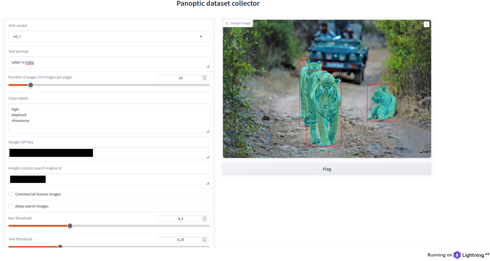

# Dataset Collector

## Description
This repository is an open-source project to create a dataset of panoptic annotated data ([COCO format](https://cocodataset.org/#download)) of user-defined class labels using google image search in combination with the recent works of [Grounding Dino](https://github.com/IDEA-Research/GroundingDINO) and Meta's [segment-anything](https://github.com/facebookresearch/segment-anything). 
The idea was born from the useful tool of [Language Segment-Anything](https://github.com/luca-medeiros/lang-segment-anything) which combined the two models in an easy to use API.

### Requirements
###### Python (tested with 3.8)
###### Torch (tested with 2.0)
###### TorchVision
###### GPU (~6GB RAM)

### Installation
```
git clone  git@github.com:ub216/panoptic_dataset_collector.git && cd panoptic_dataset_collector
pip install torch torchvision
pip install -e .
```

### Usage
To collect the data you need to:
1. Create a [google programmable search engine](https://programmablesearchengine.google.com/about/) that will allow this tool perform google image search.
2. Create a [custom search JSON API](https://developers.google.com/custom-search/v1/overview) to convert the search results into JSON format.

Both these features are free with your google account. You can search upto 100 pages-per-day for free. Each pages gives you 10 results giving you upto 1000 free annotated images per day! By paying $5 to [google](https://developers.google.com/custom-search/v1/overview#pricing) you can even boost this to 10,000-100,0000 annotations per day.

###### To run the app:
with gui:
```
lightning run app panoptic_dataset_collector/google_search_gui.py
```

command line:
```
python3 panoptic_dataset_collector/google_search.py --search=<google_search_key> --label_file=<path_to_class_label_file> --engine_id=<google_search_engine_id> --api_key=<custom_json_api_key>
```
###### Example:

```
python3 panoptic_dataset_collector/google_search.py --search="safari in india" --label_file=panoptic_dataset_collector/safari_in_india.yaml --engine_id=<google_search_engine_id> --api_key=<custom_json_api_key>
```

Sample label file is provided that can be modified as per convenience. Its best to provide a search key that would return majority images with the required class labels.

###### GUI Output:


#### Additional flags
1. Change the number of pages to search per keyword using `--search_pages` flag (defaults to 10).
2. Perform a depper search by crawling the url of returned images to look for more images. This can be done with the `--deep_search` option. **Note** this will take a longer time.
3. You could restrict the tool to only return images with commercial license using the `--commercial_only` flag. **Note** only the images would be commercial. The annotations, requires models that could have restricted license. Please refer to the links in description.

#### To Do
- [x] Add an easy to use GUI interface
- [x] Handle multiple detections of same object

## Acknowledgments

This project is based on the following repositories:

- [GroundingDINO](https://github.com/IDEA-Research/GroundingDINO)
- [Segment-Anything](https://github.com/facebookresearch/segment-anything)
- [Language Segment-Anything](https://github.com/luca-medeiros/lang-segment-anything)

## License
The code is provided with Apache License 2.0. For the collected images refer to individual license. For annotations, refer to model license of Grounding Dino and segment-anything.
